# Controls for Line Following Mobot
## 16299 Controls Final Project

<p align="center">
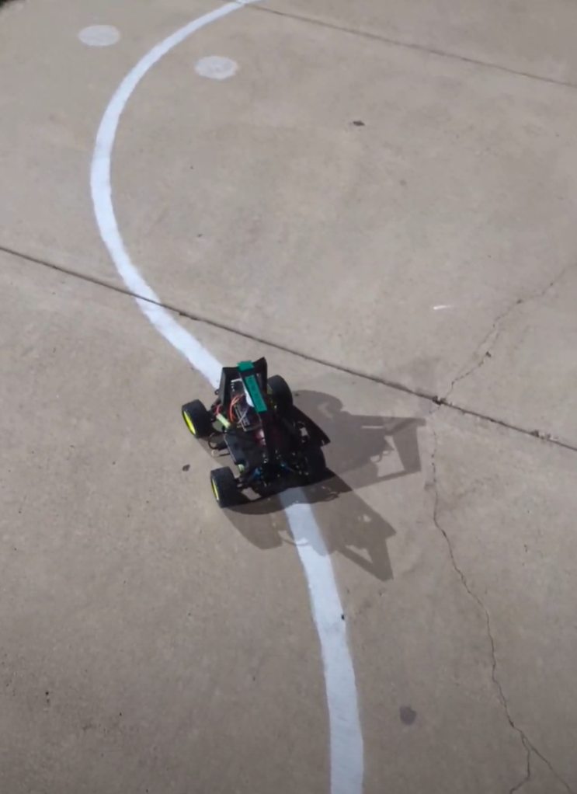
</p>

## What is Mobots?
Mobots is an annual tradition at CMU during Carnival where competitors build minitaure robots which race on a sidewalk outsiode of Wean hall. The robots must navigate a known course, typically by following the white painted line, and go through each numbered gate in order as fast as possible. The course for 2023 can be seen below.
<p align="center">
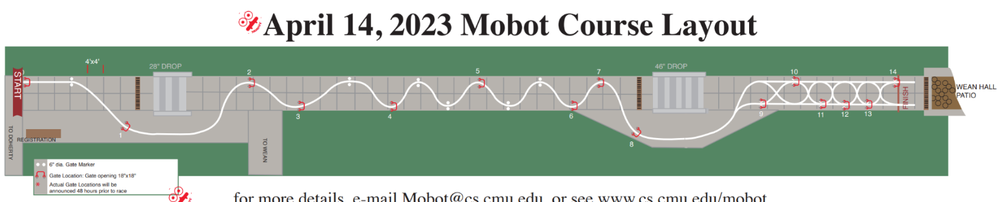
</p>

The course is roughly split into two halves, the slolam race where mobots can simply follow a line and the decision point challenge towards the end where the mobots need to make decisions about whether to steer left or right depending on the location of the gates.

Here is a picture of my mobot from 2022.
<p align="center">
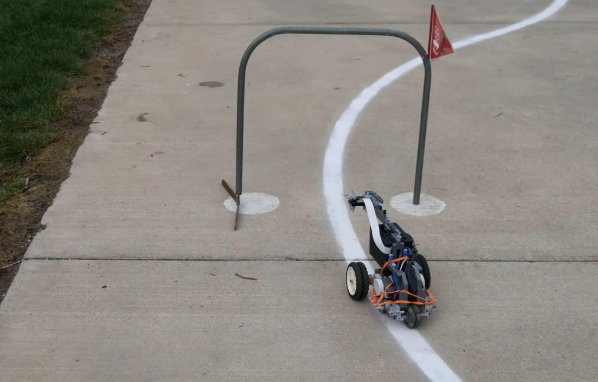
</p>

## Mechanical Design
I am hacking a 1/16th RC Car and controlling it with a Raspberry Pi. I also printed a body plate and a frame to mount the electronics and the wide angle camera. This build is largely based on the [DonkeyCar](http://docs.donkeycar.com/) project.
<p align="center">
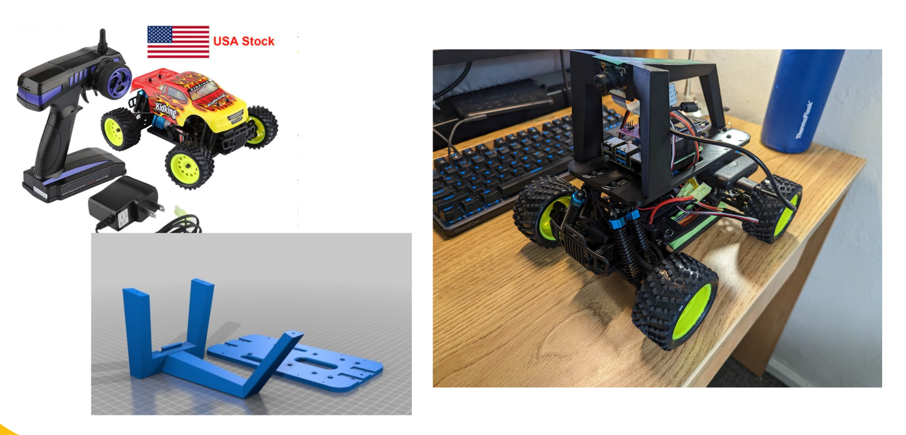
</p>

## Electronic Design
<p align="center">
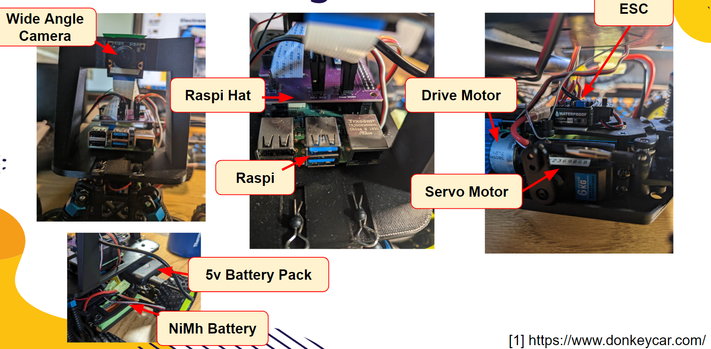
</p>
The Raspi is the brains behind everything. A hat is used to connect the Raspi with the electronic speed controller with PWM signals. The ESC then controls the Drive and Servo motors. The original RC receiver is also connected to the hat in order to allow for joystick controls during testing. The Raspi is powered with a off the shelf 5V power bank and the drive electronics are powered with a 7.2V NiMH battery pack. The wide angle camera is connected to the Raspi with the standard ribbon cable and is the only sensor on board.

## Vision Pipeline
<p align="center">
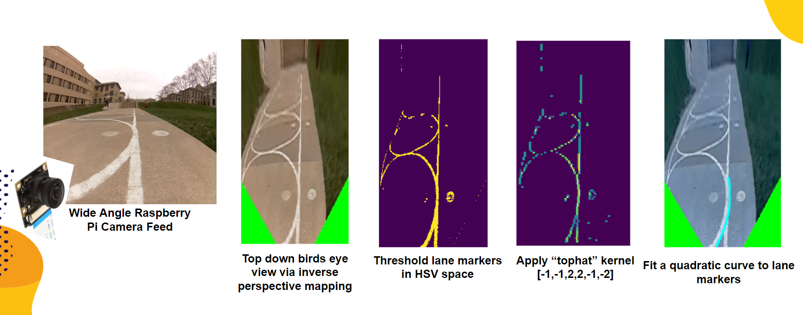
</p>
The vision pipeline is inspired by [Andy Sloane's](https://www.youtube.com/watch?v=esMiT7phZUM) work in DIYRobocars. Firstly the video feed has to be undistorted and remapped to eliminate fish eye effects. Using the a precomputed homography, we are able to generate a top down birds eye view of the course via inverse perspective mapping. With this, we threshold and apply a "tophat" kernel to isolate the lane markers. We relu out the responses and fit a quadratic curve to it. While it mostly works, this vision pipeline is highly sensitive to lighting changes and shadows, largely in the thresholding stage. 

One challenge was with dealing with shadows. The manner of thresholding regions of the lane that were in and out of the shadow required entirely different methods and the resulting two threshold maps were OR'd together. Notice that "hue" was useful for isolating bright regions of the lane, while "perceptual blueness" was useful for isolating dark regions of the lane. Due to shadows, traditional methods like otsu thresholding did not perform well.
<p align="center">
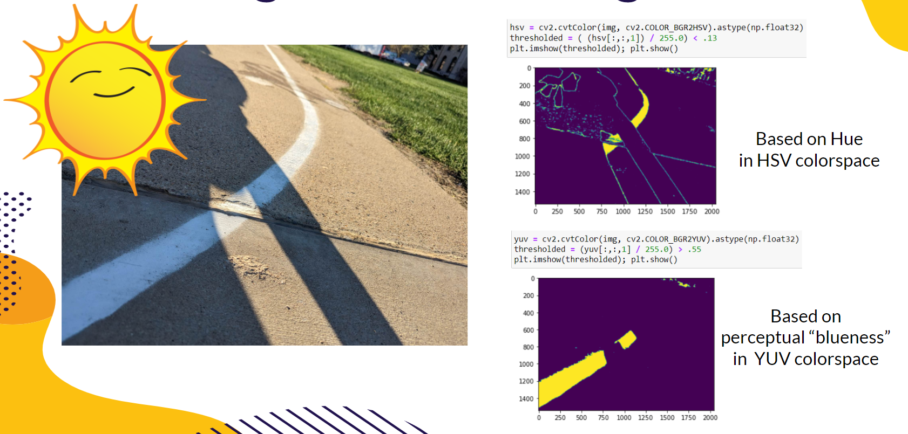
</p>

## Line Following Control Theory
<p align="center">
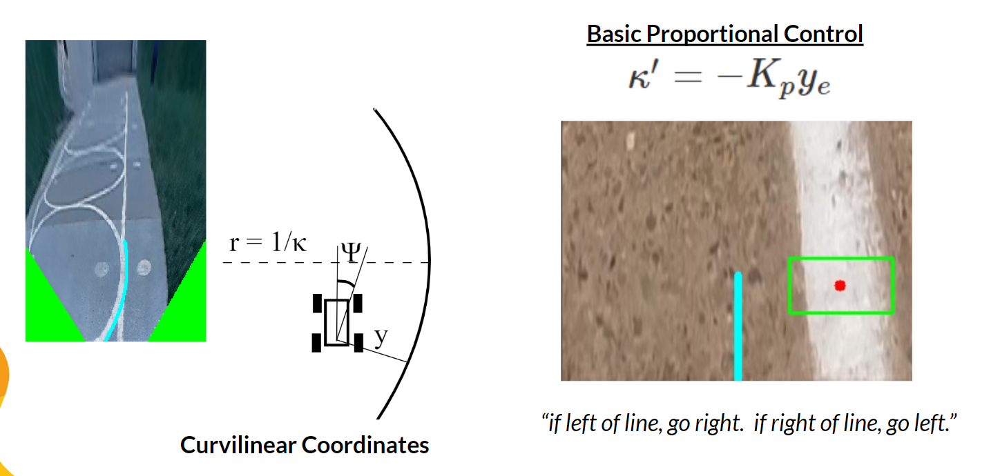
</p>
For a line follower, the only relevant state information is its position and heading with respect to the line it is trying to follow. The absolute location of the robot is pretty much unknown as well as how far along the robot is on the course. This is known is [curvilinear coordinates](https://www.a1k0n.net/2018/11/13/fast-line-following.html
).

Rudimentary line followers (like my mobot last year), generally use basic proportional control which only look at the error between the center of the lane and the camera, ignoring heading and lane curvature entirely. Though this can work, basic proportional control struggles on sharp turns as it tends to under or overshoot.

<p align="center">
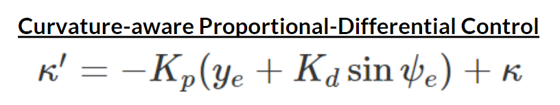
</p>

A better approach is to incorporate heading and lane curvature information. The is done by taking the slope and curvature of the quadratic. This allows the mobot to fare better on curves and results in a smoother ride with fewer oscillations empirically. The lane curvature term ensures that the robot is not "suprised" by turns.

<p align="center">
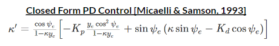
</p>
This is a closed form solution that apparantly performs better that I did not use.

# Contending with Decision Points
<p align="center">
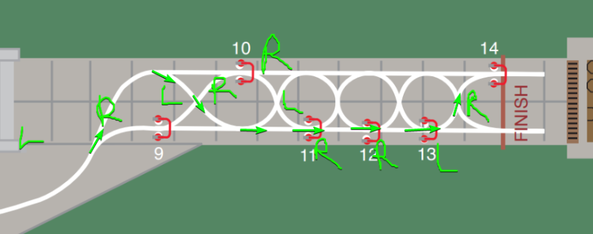
</p>
As mentioned previously, the decision points challenge tests the mobot by ensuring that it executes a predetermined sequence of turns correctly. Though I had implemented the code to do this, I have not been able to get it to work successfully as I have focused my efforts on tuning performance in the earlier section. The basic strategy is based on the realization that we can look for forks in the road (going from seeing one lane marker to two), and then switch from hugging the left lane marker to the right lane marker and vice versa. To fit a quadratic curve on the right lane marker, we can simply look for the left lane marker in each horizontal slice of the thresholded image and zero out that response, leaving just the right lane marker.

# Running Software
After setting up and calibrating the hardware for DonkeyCar, run:
```
python3 cvcar/manage.py drive
```
```